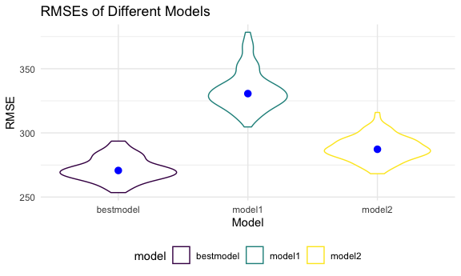
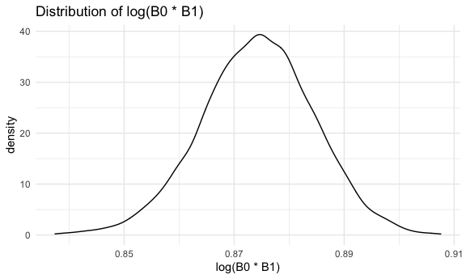

Homework6
================
Jialiang Hua
12/2/2021

# Problem 1

## Import the data

``` r
# Check for missing data
anyNA(read_csv("./data/birthweight.csv"))
```

    ## Rows: 4342 Columns: 20

    ## ── Column specification ────────────────────────────────────────────────────────
    ## Delimiter: ","
    ## dbl (20): babysex, bhead, blength, bwt, delwt, fincome, frace, gaweeks, malf...

    ## 
    ## ℹ Use `spec()` to retrieve the full column specification for this data.
    ## ℹ Specify the column types or set `show_col_types = FALSE` to quiet this message.

    ## [1] FALSE

``` r
birthweight_df = 
  read_csv("./data/birthweight.csv") %>% 
  mutate(
    babysex = case_when(
      babysex == 1 ~ "Male",
      babysex == 2 ~ "Female"
    ),
    frace = case_when(
      frace == 1 ~ "White",
      frace == 2 ~ "Black",
      frace == 3 ~ "Asian",
      frace == 4 ~ "Puerto Rican",
      frace == 8 ~ "Other",
      frace == 9 ~ "Unknown"
    ),
    malform = case_when(
      malform == 0 ~ "absent", 
      malform == 1 ~ "present"
    ),
    mrace = case_when(
      mrace == 1 ~ "White", 
      mrace == 2 ~ "Black", 
      mrace == 3 ~ "Asian", 
      frace == 4 ~ "Puerto Rican",
      frace == 8 ~ "Other"
    )
  ) %>% 
  mutate(
    babysex = as.factor(babysex),
    frace = as.factor(frace),
    malform = as.factor(malform),
    mrace = as.factor(mrace)
  ) 
```

    ## Rows: 4342 Columns: 20

    ## ── Column specification ────────────────────────────────────────────────────────
    ## Delimiter: ","
    ## dbl (20): babysex, bhead, blength, bwt, delwt, fincome, frace, gaweeks, malf...

    ## 
    ## ℹ Use `spec()` to retrieve the full column specification for this data.
    ## ℹ Specify the column types or set `show_col_types = FALSE` to quiet this message.

## Set two models

``` r
model1 = lm(bwt ~ blength + gaweeks, data = birthweight_df)
broom::tidy(model1)
```

    ## # A tibble: 3 × 5
    ##   term        estimate std.error statistic  p.value
    ##   <chr>          <dbl>     <dbl>     <dbl>    <dbl>
    ## 1 (Intercept)  -4348.      98.0      -44.4 0       
    ## 2 blength        129.       1.99      64.6 0       
    ## 3 gaweeks         27.0      1.72      15.7 2.36e-54

``` r
model2 = lm(bwt ~ bhead + blength + babysex + bhead*blength + blength*babysex + bhead*babysex + bhead*blength*babysex, data = birthweight_df)
broom::tidy(model2)
```

    ## # A tibble: 8 × 5
    ##   term                      estimate std.error statistic    p.value
    ##   <chr>                        <dbl>     <dbl>     <dbl>      <dbl>
    ## 1 (Intercept)                -802.    1102.       -0.728 0.467     
    ## 2 bhead                       -16.6     34.1      -0.487 0.626     
    ## 3 blength                     -21.6     23.4      -0.926 0.354     
    ## 4 babysexMale               -6375.    1678.       -3.80  0.000147  
    ## 5 bhead:blength                 3.32     0.713     4.67  0.00000317
    ## 6 blength:babysexMale         124.      35.1       3.52  0.000429  
    ## 7 bhead:babysexMale           198.      51.1       3.88  0.000105  
    ## 8 bhead:blength:babysexMale    -3.88     1.06     -3.67  0.000245

## Propose a model

**1. Predictor Selection - We use backward to build the model**

We fit a regression using all predictors, and use AIC criterion for var
selection, from which we choose the model with the smallest value.

``` r
all_fit = lm(bwt ~ babysex + bhead + blength + fincome + frace + gaweeks + malform + menarche + mheight + momage + mrace + parity + pnumlbw + pnumsga + ppbmi + ppwt + smoken + wtgain,data = birthweight_df)
broom::tidy(all_fit) 
```

    ## # A tibble: 23 × 5
    ##    term               estimate std.error statistic   p.value
    ##    <chr>                 <dbl>     <dbl>     <dbl>     <dbl>
    ##  1 (Intercept)       -6141.      679.      -9.04   2.40e- 19
    ##  2 babysexMale         -27.8       8.70    -3.19   1.41e-  3
    ##  3 bhead               133.        3.55    37.3    3.42e-262
    ##  4 blength              75.0       2.08    36.0    7.01e-247
    ##  5 fincome               0.310     0.181    1.71   8.76e-  2
    ##  6 fraceBlack            7.21     81.7      0.0882 9.30e-  1
    ##  7 fraceOther           -6.00     98.9     -0.0606 9.52e-  1
    ##  8 fracePuerto Rican  -181.       88.6     -2.04   4.14e-  2
    ##  9 fraceWhite           -9.88     71.4     -0.138  8.90e-  1
    ## 10 gaweeks              11.2       1.53     7.37   2.04e- 13
    ## # … with 13 more rows

``` r
step(all_fit, direction = 'backward') %>% broom::tidy()
```

    ## Start:  AIC=45980.37
    ## bwt ~ babysex + bhead + blength + fincome + frace + gaweeks + 
    ##     malform + menarche + mheight + momage + mrace + parity + 
    ##     pnumlbw + pnumsga + ppbmi + ppwt + smoken + wtgain
    ## 
    ## 
    ## Step:  AIC=45980.37
    ## bwt ~ babysex + bhead + blength + fincome + frace + gaweeks + 
    ##     malform + menarche + mheight + momage + mrace + parity + 
    ##     pnumlbw + ppbmi + ppwt + smoken + wtgain
    ## 
    ## 
    ## Step:  AIC=45980.37
    ## bwt ~ babysex + bhead + blength + fincome + frace + gaweeks + 
    ##     malform + menarche + mheight + momage + mrace + parity + 
    ##     ppbmi + ppwt + smoken + wtgain
    ## 
    ##            Df Sum of Sq       RSS   AIC
    ## - ppbmi     1        30 301931973 45978
    ## - malform   1       715 301932658 45978
    ## - ppwt      1     19198 301951141 45979
    ## - mheight   1     25122 301957065 45979
    ## - momage    1     57257 301989200 45979
    ## - menarche  1     73367 302005310 45979
    ## <none>                  301931943 45980
    ## - fincome   1    216121 302148064 45981
    ## - frace     4    752621 302684564 45983
    ## - parity    1    396711 302328654 45984
    ## - mrace     2    790528 302722471 45987
    ## - babysex   1    755446 302687389 45989
    ## - gaweeks   1   4022633 305954576 46033
    ## - smoken    1   5012083 306944026 46046
    ## - wtgain    1   8529202 310461145 46093
    ## - blength   1  96037720 397969663 47110
    ## - bhead     1 102973324 404905267 47181
    ## 
    ## Step:  AIC=45978.37
    ## bwt ~ babysex + bhead + blength + fincome + frace + gaweeks + 
    ##     malform + menarche + mheight + momage + mrace + parity + 
    ##     ppwt + smoken + wtgain
    ## 
    ##            Df Sum of Sq       RSS   AIC
    ## - malform   1       717 301932690 45976
    ## - momage    1     57228 301989201 45977
    ## - menarche  1     73339 302005312 45977
    ## <none>                  301931973 45978
    ## - fincome   1    216095 302148068 45979
    ## - frace     4    752738 302684711 45981
    ## - parity    1    396923 302328896 45982
    ## - mrace     2    790557 302722530 45985
    ## - babysex   1    755512 302687485 45987
    ## - mheight   1    896882 302828855 45989
    ## - ppwt      1   2156998 304088971 46006
    ## - gaweeks   1   4023216 305955189 46031
    ## - smoken    1   5012322 306944295 46044
    ## - wtgain    1   8530150 310462123 46091
    ## - blength   1  96040935 397972908 47108
    ## - bhead     1 103058385 404990357 47180
    ## 
    ## Step:  AIC=45976.38
    ## bwt ~ babysex + bhead + blength + fincome + frace + gaweeks + 
    ##     menarche + mheight + momage + mrace + parity + ppwt + smoken + 
    ##     wtgain
    ## 
    ##            Df Sum of Sq       RSS   AIC
    ## - momage    1     57530 301990220 45975
    ## - menarche  1     73515 302006205 45975
    ## <none>                  301932690 45976
    ## - fincome   1    215649 302148339 45977
    ## - frace     4    753023 302685713 45979
    ## - parity    1    396780 302329470 45980
    ## - mrace     2    790539 302723229 45983
    ## - babysex   1    754979 302687669 45985
    ## - mheight   1    896385 302829075 45987
    ## - ppwt      1   2157133 304089823 46004
    ## - gaweeks   1   4022523 305955213 46029
    ## - smoken    1   5012391 306945081 46042
    ## - wtgain    1   8546011 310478701 46089
    ## - blength   1  96058519 397991209 47107
    ## - bhead     1 103069367 405002057 47178
    ## 
    ## Step:  AIC=45975.16
    ## bwt ~ babysex + bhead + blength + fincome + frace + gaweeks + 
    ##     menarche + mheight + mrace + parity + ppwt + smoken + wtgain
    ## 
    ##            Df Sum of Sq       RSS   AIC
    ## - menarche  1     53784 302044004 45974
    ## <none>                  301990220 45975
    ## - fincome   1    279916 302270136 45977
    ## - frace     4    744531 302734751 45977
    ## - parity    1    422189 302412409 45979
    ## - mrace     2    797659 302787880 45982
    ## - babysex   1    744057 302734277 45983
    ## - mheight   1    896141 302886361 45985
    ## - ppwt      1   2298270 304288490 46004
    ## - gaweeks   1   4091288 306081508 46028
    ## - smoken    1   5018722 307008942 46041
    ## - wtgain    1   8488972 310479192 46087
    ## - blength   1  96019143 398009363 47105
    ## - bhead     1 103091516 405081736 47177
    ## 
    ## Step:  AIC=45973.89
    ## bwt ~ babysex + bhead + blength + fincome + frace + gaweeks + 
    ##     mheight + mrace + parity + ppwt + smoken + wtgain
    ## 
    ##           Df Sum of Sq       RSS   AIC
    ## <none>                 302044004 45974
    ## - fincome  1    282782 302326786 45976
    ## - frace    4    751551 302795555 45976
    ## - parity   1    415868 302459872 45978
    ## - mrace    2    793642 302837646 45981
    ## - babysex  1    747865 302791869 45982
    ## - mheight  1    856011 302900016 45983
    ## - ppwt     1   2406599 304450603 46004
    ## - gaweeks  1   4087023 306131027 46027
    ## - smoken   1   5043498 307087502 46040
    ## - wtgain   1   8609245 310653249 46087
    ## - blength  1  96179182 398223186 47105
    ## - bhead    1 103041238 405085242 47175

    ## # A tibble: 17 × 5
    ##    term               estimate std.error statistic   p.value
    ##    <chr>                 <dbl>     <dbl>     <dbl>     <dbl>
    ##  1 (Intercept)       -6163.      146.     -42.3    0        
    ##  2 babysexMale         -27.6       8.70    -3.18   1.49e-  3
    ##  3 bhead               133.        3.55    37.3    1.64e-262
    ##  4 blength              75.0       2.08    36.1    2.34e-247
    ##  5 fincome               0.345     0.177    1.95   5.07e-  2
    ##  6 fraceBlack            4.94     81.6      0.0605 9.52e-  1
    ##  7 fraceOther           -8.03     98.8     -0.0813 9.35e-  1
    ##  8 fracePuerto Rican  -182.       88.5     -2.05   4.02e-  2
    ##  9 fraceWhite          -10.4      71.3     -0.146  8.84e-  1
    ## 10 gaweeks              11.3       1.52     7.43   1.30e- 13
    ## 11 mheight               6.20      1.82     3.40   6.77e-  4
    ## 12 mraceBlack          -70.0      82.9     -0.845  3.98e-  1
    ## 13 mraceWhite           83.2      73.1      1.14   2.55e-  1
    ## 14 parity               95.5      40.3      2.37   1.78e-  2
    ## 15 ppwt                  1.35      0.237    5.70   1.26e-  8
    ## 16 smoken               -4.93      0.597   -8.26   2.01e- 16
    ## 17 wtgain                4.36      0.404   10.8    9.11e- 27

**2. Get the final model**

According to the result of first step, we can get some reasonable
predictors which we can use to build the model.

``` r
best_model = lm(bwt ~ fincome + frace + parity + mrace + babysex + mheight+ ppwt+ gaweeks + smoken + wtgain + blength + bhead, data = birthweight_df)
broom::tidy(best_model)
```

    ## # A tibble: 17 × 5
    ##    term               estimate std.error statistic   p.value
    ##    <chr>                 <dbl>     <dbl>     <dbl>     <dbl>
    ##  1 (Intercept)       -6163.      146.     -42.3    0        
    ##  2 fincome               0.345     0.177    1.95   5.07e-  2
    ##  3 fraceBlack            4.94     81.6      0.0605 9.52e-  1
    ##  4 fraceOther           -8.03     98.8     -0.0813 9.35e-  1
    ##  5 fracePuerto Rican  -182.       88.5     -2.05   4.02e-  2
    ##  6 fraceWhite          -10.4      71.3     -0.146  8.84e-  1
    ##  7 parity               95.5      40.3      2.37   1.78e-  2
    ##  8 mraceBlack          -70.0      82.9     -0.845  3.98e-  1
    ##  9 mraceWhite           83.2      73.1      1.14   2.55e-  1
    ## 10 babysexMale         -27.6       8.70    -3.18   1.49e-  3
    ## 11 mheight               6.20      1.82     3.40   6.77e-  4
    ## 12 ppwt                  1.35      0.237    5.70   1.26e-  8
    ## 13 gaweeks              11.3       1.52     7.43   1.30e- 13
    ## 14 smoken               -4.93      0.597   -8.26   2.01e- 16
    ## 15 wtgain                4.36      0.404   10.8    9.11e- 27
    ## 16 blength              75.0       2.08    36.1    2.34e-247
    ## 17 bhead               133.        3.55    37.3    1.64e-262

**3. Make a plot of the “best” model**

``` r
# a plot of model residuals against fitted values
birthweight_df %>% 
  add_residuals(best_model) %>% 
  add_predictions(best_model) %>% 
  ggplot(aes( x = pred, y = resid)) +
  geom_point(alpha = 0.3)
```

    ## Warning: Removed 243 rows containing missing values (geom_point).


Everything is centered around 0, and it makes sense, and most points are
scatter around roughly prediction = 3200, but there are some departure
towards left in prediction and some towards up in residuals, which means
that if baby birth weight tends low, the residuals will become high.

## Compare these models

**1. Cross Validation**

``` r
cv_df = 
  crossv_mc(birthweight_df, 100)
cv_df = 
  cv_df %>% 
  mutate(
    firmod = map(.x = train, ~lm(bwt ~ blength + gaweeks, data = birthweight_df)),
    secmod = map(.x = train, ~lm(bwt ~ bhead + blength + babysex + bhead*blength + blength*babysex + bhead*babysex + bhead*blength*babysex, data = birthweight_df)),
    bestmod = map(.x = train, ~lm(bwt ~ fincome + frace + parity + mrace + babysex + mheight+ ppwt+ gaweeks + smoken + wtgain + blength + bhead, data = birthweight_df))
  ) %>% 
  mutate(
    rmse_model1 = map2_dbl(.x = firmod, .y = test, ~rmse(model = .x, data =.y)),
    rmse_model2 = map2_dbl(.x = secmod, .y = test, ~rmse(model = .x, data =.y)),
    rmse_bestmodel = map2_dbl(.x = bestmod, .y = test, ~rmse(model = .x, data =.y))
  )
```

**2. See the distribution of three models RMSE**

``` r
cv_df %>% 
  select(starts_with("rmse")) %>% 
  pivot_longer(
    everything(),
    names_to = "model",
    values_to = "rmse",
    names_prefix = "rmse_"
  ) %>% 
  ggplot(aes(x = model, y = rmse, color = model)) +
  geom_violin() +
  stat_summary(fun = "median", color = "blue") +
  labs(
    x = "Model",
    y = "RMSE",
    title = "RMSEs of Different Models"
  )
```

    ## Warning: Removed 3 rows containing missing values (geom_segment).



From the plot, we can see that among three models, the model 1 has the
lowest RMSE, which indicates that it is a better model than the other
two models.

## Problem 2

``` r
weather_df = 
  rnoaa::meteo_pull_monitors(
    c("USW00094728"),
    var = c("PRCP", "TMIN", "TMAX"), 
    date_min = "2017-01-01",
    date_max = "2017-12-31") %>%
  mutate(
    name = recode(id, USW00094728 = "CentralPark_NY"),
    tmin = tmin / 10,
    tmax = tmax / 10) %>%
  select(name, id, everything())
```

    ## Registered S3 method overwritten by 'hoardr':
    ##   method           from
    ##   print.cache_info httr

    ## using cached file: ~/Library/Caches/R/noaa_ghcnd/USW00094728.dly

    ## date created (size, mb): 2021-09-12 11:25:55 (7.599)

    ## file min/max dates: 1869-01-01 / 2021-09-30

let’s bootstrap

``` r
weather_boot =
  weather_df %>% 
  drop_na() %>% 
  bootstrap(5000, id = "strap_number") %>% 
  mutate(
    models = map(.x = strap, ~lm(tmax ~ tmin, data = .x)),
    results = map(models, broom::tidy),
    result_r = map(models, broom::glance)
  ) %>% 
  select(strap_number, results, result_r) %>% 
  unnest(results, result_r)
```

    ## Warning: unnest() has a new interface. See ?unnest for details.
    ## Try `df %>% unnest(c(results, result_r))`, with `mutate()` if needed

Calculate *l**o**g*(*β*<sub>0</sub> \* *β*<sub>1</sub>)

``` r
callog =
  weather_boot %>% 
  dplyr::select(strap_number, term, estimate) %>% 
  pivot_wider(names_from = term,
              values_from = estimate) %>% 
  rename(intercept ="(Intercept)") %>% 
  mutate(logBB = log10(intercept*tmin))
```

Plot the distribution of *l**o**g*(*β*<sub>0</sub> \* *β*<sub>1</sub>)

``` r
callog %>% 
  ggplot(aes(x = logBB)) +
  geom_density() + 
  xlab("log(B0 * B1)") +
  ggtitle("Distribution of log(B0 * B1)")
```



It could find from the figure that the distribution of
*l**o**g*(*β*<sub>0</sub> \* *β*<sub>1</sub>) is approximately normal,
when *l**o**g*(*β*<sub>0</sub> \* *β*<sub>1</sub>) around 0.875, it has
maximum density. The distribution is little right-skewed, which may be
better with higher bootstrap times.

Calculate the 95% CI

``` r
callog %>% 
  summarize(
    ci_lower = quantile(logBB, 0.025),
    ci_upper = quantile(logBB,0.975)
  ) %>% 
  knitr::kable()
```

| ci\_lower | ci\_upper |
|----------:|----------:|
|   0.85346 | 0.8939419 |

Calculate *r*<sup>2</sup>

``` r
r_square =
  weather_boot %>% 
  filter(term == "tmin") %>% 
  dplyr::select(r.squared) 
```

Plot the distribution of *r*<sup>2</sup>

``` r
r_square %>% 
  ggplot(aes(x = r.squared)) +
  geom_density() + 
  xlab("r square") +
  ggtitle("Distribution of r square")
```


It could find from the figure that the distribution of *r*<sup>2</sup>
is approximately normal, when *r*<sup>2</sup> around 0.91, it has
maximum density. *r*<sup>2</sup> indicates the percentage of the
response variable variation that is explained by a linear model. When
*r*<sup>2</sup> is closer to 1, it means model fit data better. From the
distribution, it seems the model shows good fitness to the data.

Calculate the 95% CI

``` r
r_square %>% 
  summarize(
    ci_lower = quantile(r.squared, 0.025),
    ci_upper = quantile(r.squared,0.975)
  ) %>% 
  knitr::kable()
```

| ci\_lower | ci\_upper |
|----------:|----------:|
| 0.8939161 | 0.9269252 |
